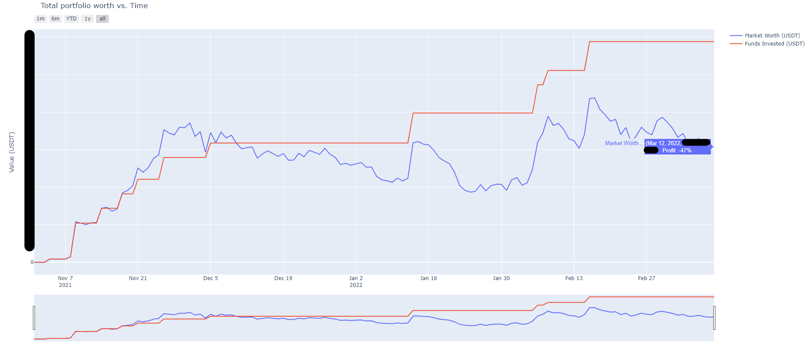
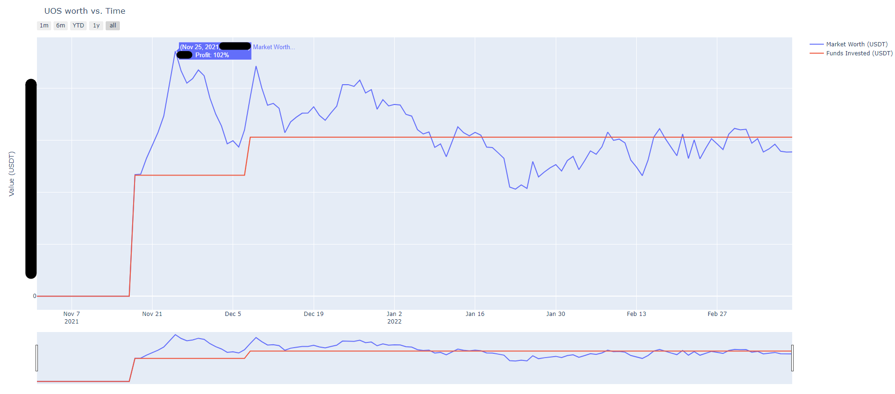

# Kucoin Crypto Tracker Guide

---

## Description
The **_Kucoin Crypto Tracker_** shows the account holder their aggregate,
and per-coin profits/losses over time and across all accounts. The official
Kucoin app does not make it possible for the user to view the performance of
their account over time, or track any losses/gains of realized or unrealized
gains. This tool leverages the Kucoin API to extract the aggregate and
per-coin performance of the users account and displays the data in interactive
plots, allowing the user to quickly make informed decisions with regard to 
their investments.

## Setup
1. Clone repository 
2. Gain API keys to your Kucoin account with "read" privileges
3. Install dependencies
   - `pip install kucoin-python`
   - `pip install plotly==5.6.0`
   - `pip install tqdm`
4. Fill in `utilities.py` with your credentials and account information (API keys)
   1. Enter API key information
   2. Enter start date of account usage

## Usage
1. Run `crypto_tracker.py` (first run may take 60+ minutes depending on the age of the account due to
API request rate limitations, but future runs will take much less time)
2. View your aggregate, and per-coin profits/losses over time and across all accounts

## Example Output
### Aggregate Performance (screenshot of interactive plot with dummy data)

### Per-coin Performance (screenshot of interactive plot with dummy data)

